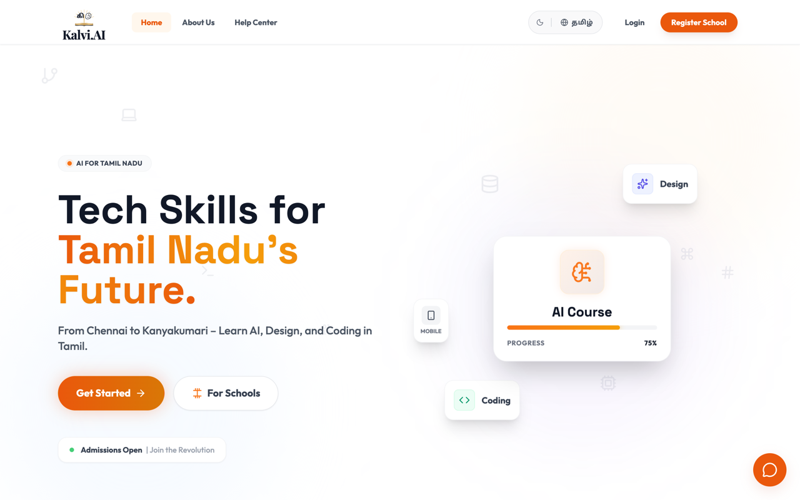

<h1 align="center">Kalvi.AI</h1>
<p align="center"><b>Tech skills for Tamil Nadu's future.</b></p>

<p align="center">
  <a href="https://kalvi-ai-five.vercel.app"><b>Live demo →</b></a>
</p>

<p align="center">
  
</p>

---

## The idea

Most Indian edtech is built in English and translated afterwards. Translation-last means the Tamil experience is always the degraded one — awkward phrasing, English technical terms left untranslated, UI that doesn't fit the longer strings.

Kalvi.AI is **Tamil-first**. The language toggle is in the header, not buried in settings, and the content is written for Tamil speakers learning AI, design and coding — from Chennai to Kanyakumari.

## What's in it

- AI, design and coding courses with progress tracking
- A Tamil ⇄ English toggle that applies across the whole product
- School registration, so institutions can onboard their students as a group
- Light and dark themes
- An AI assistant for learners, built on Gemini

## Stack

`React 19` · `TypeScript` · `Vite` · `Gemini` · `Supabase` · `Recharts`

```
main/
  App.tsx           Root
  components/       UI
  services/         Gemini + Supabase clients
  utils/            Helpers
  constants.ts      Course + content data
  supabase_setup.sql
  sw.js             Service worker
```

## Running it

```bash
cd main
npm install
npm run dev
```

Set your Supabase and Gemini keys in a `.env.local` first — see `services/` for the variables it reads. Database schema is in `supabase_setup.sql`.
